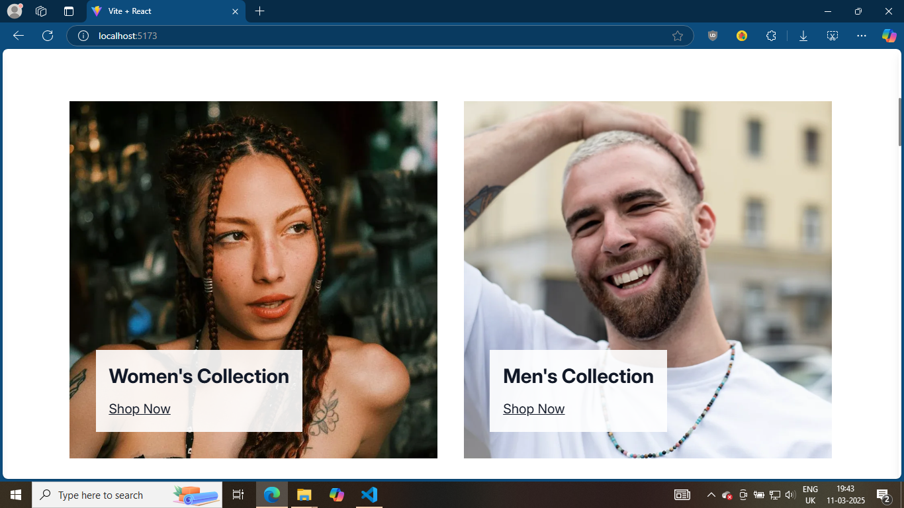
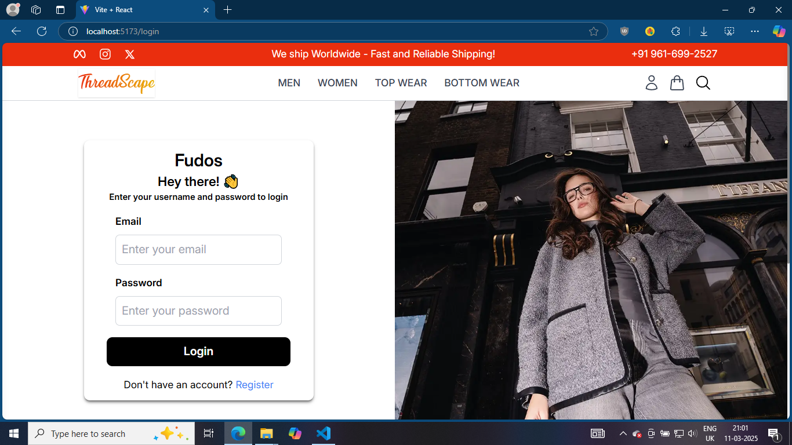
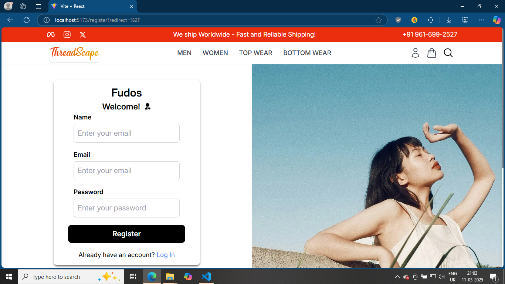
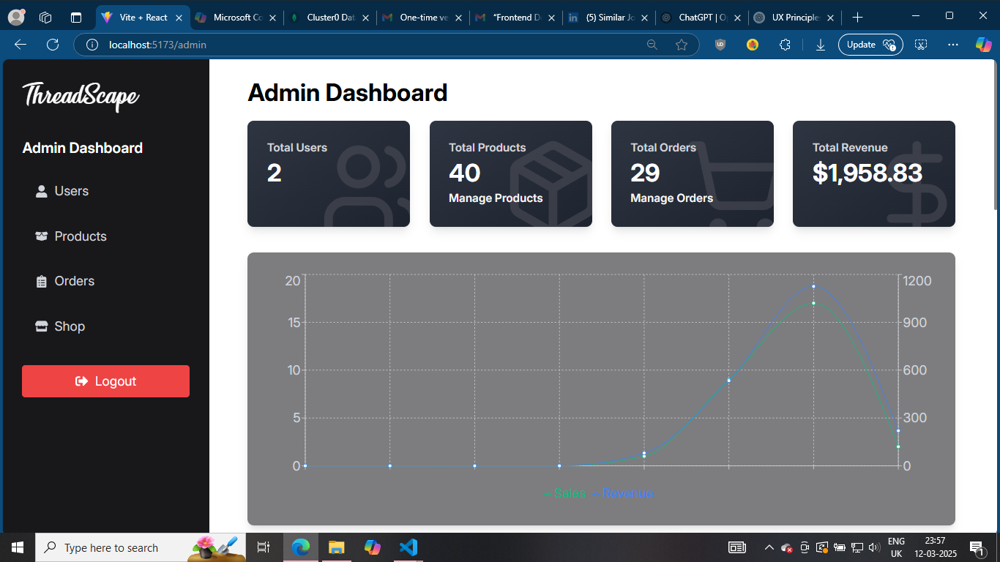
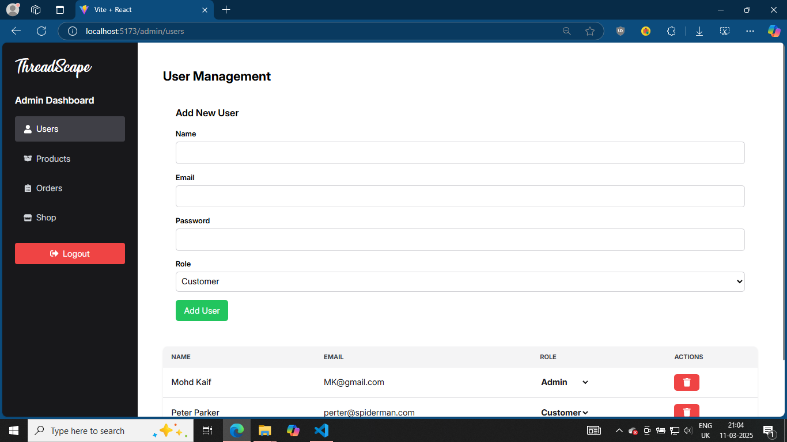
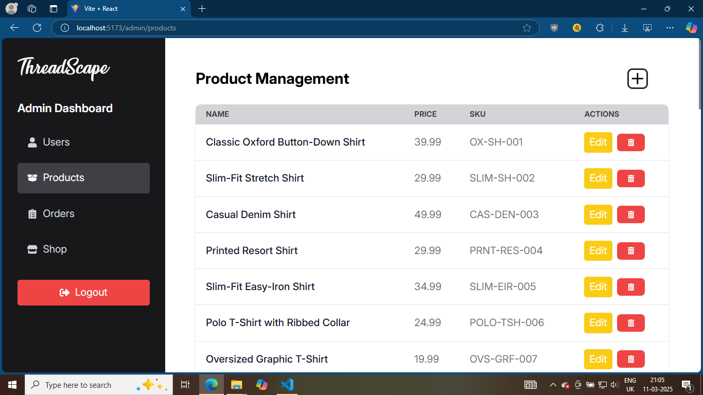
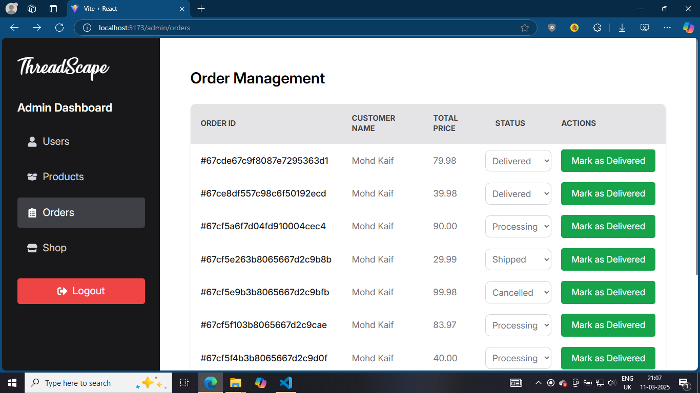

# 🛍️ ThreadScape - E-commerce Management System (EMS)

## 📌 Overview
**ThreadScape** is a fashion-focused **E-commerce Management System (EMS)** built using the **MERN Stack**. It provides a seamless, secure, and efficient shopping experience with robust product catalog management and integrated secure payment processing.

## 🚀 Technologies Used
- **MongoDB** - NoSQL database for scalable data storage.
- **Express.js** - Backend framework for handling API requests.
- **React.js** - Frontend framework for a dynamic and intuitive user interface.
- **Node.js** - Server-side runtime for efficient backend operations.
- **Redux** - For state management

## ✨ Features
- 🔒 **Secure Payment Processing**: Reduces fraudulent transactions by 15% and ensures customer trust.
- 🛒 **Product Catalog Management**: Easy-to-use interface for adding, updating, and managing products.
- 🖥️ **Intuitive UI/UX**: Provides a smooth and engaging shopping experience.
- 📈 **Performance Optimization**: Ensures fast and responsive interactions.
- 🛡️ **Enhanced Security Measures**: Protects customer data and transactions.

## 🌐 Live Link
Check out the live demo here: [ThreadScape Live](https://threadscape-kai.vercel.app/)
- While Payment use this dummy card -
  ```sh
     Card No. 4242 4242 4242 4242
     MM/YY - 04/25
     cvv - 424
     

## 🛠️ Installation & Setup
1. **Clone the Repository**  
   ```sh
   git clone https://github.com/yourusername/ThreadScape.git
   cd ThreadScape
2. **Install Dependencies**
   ```sh
   npm install
3. Make Sure to create your MongoURI and Paste in the .env file you will create.
4. **Run the Development Server**
   - For Backend
       ```sh
       cd backend
       npm run dev
    - For Frontend
      ```sh
      cd frontend
      npm run dev

## Screenshots
- HOME - LANDING PAGE
   
- GENDER COLLECTIONS 
   
- LOGIN PAGE
   
- REGISTER PAGE
   
- ADMIN DASHBOARD
   
- USER MANAGEMENT PAGE
   
- PRODUCT MANAGEMENT PAGE
   
- ORDER MANAGEMENT PAGE
   


## 🔮 Future Enhancements
- 🏷️ Personalized Recommendations: AI-driven suggestions based on user behavior.
- 📦 Order & Inventory Management: Improve logistics and stock tracking.
- 🌍 Multi-language & Multi-currency Support: Expand global reach.
- 🤝 Contribution

We welcome contributions! Feel free to fork the repository and submit a pull request.

## 📜 License
This project is open-source and available under the MIT License.


  
